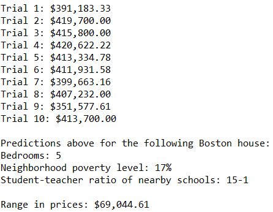

# Boston Housing

This project leverages machine learning to predict Boston housing prices based on four features. This project provides good starter code for Decision Tree projects, Grid Search CV projects, and shows how to find the optimal max depth of a Decision Tree.

Below is an example of the project's output:

## To Use

To use this project you must download the following three files into the same folder on your local machine:
- boston_housing_ml.py
- housing.csv
- visuals.py

Then, you can run the file boston_housing_ml.py.

## Prerequisites

Python 2.6

# Libraries Used

- numpy
- pandas
- from sklearn.cross_validation import ShuffleSplit
- from sklearn.metrics import r2_score
- from sklearn.metrics import make_scorer
- from sklearn.tree import DecisionTreeRegressor
- from sklearn.model_selection import GridSearchCV

## Author

Michael O'Donnell
mro4354@gmail.com
